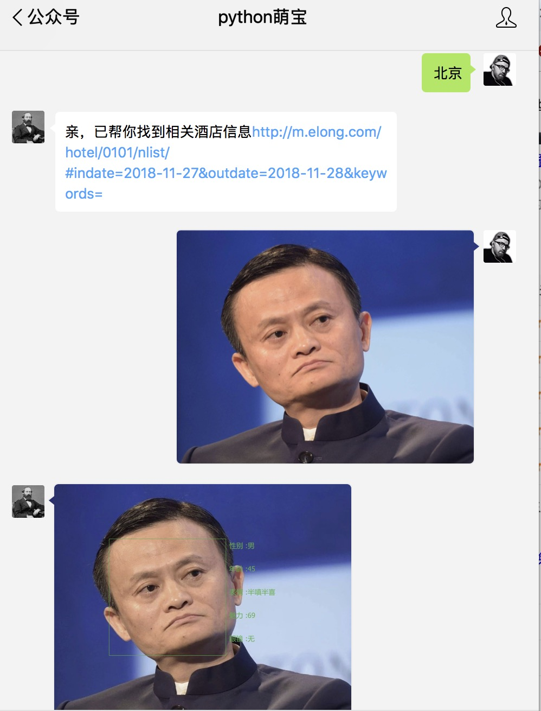
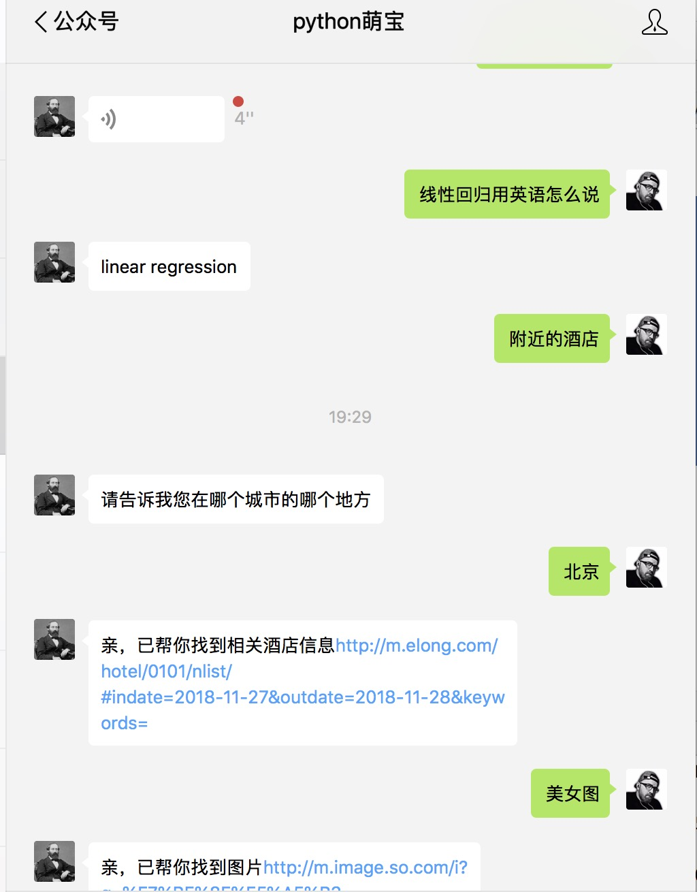

# 基于flask的微信公众号智能机器人
功能：
* [x] 人脸检测
* [x] 图灵聊天机器人
* [x]  语音聊天



### 环境依赖：
```pyton
Flask_Migrate==2.0.3
opencv_python==3.4.3.18
numpy==1.15.4
Flask_SQLAlchemy==2.2
Flask==0.12.1
requests==2.19.1
wechatpy==1.7.5
Flask_Script==2.0.6
Pillow==5.3.0
```

### 使用说明
* pip3 install -r requirements.txt 安装所需包
* 打开seting.py必要设置

### api设置
到对应官方申请对应的api设置
```python
# 图灵
TULING_API_KEY = 'ef1b770c6b044cd787701e13929c563b'
TULING_UER_ID = 'python'

# 腾讯人脸识别
TENCENT_APP_ID = '1106860829'
TENCENT_APP_KEY = 'P8Gt8nxi6k8vLKbS'

# 微信公众号配置
WX_TOKEN = ''
WX_APP_ID = ''
WX_SECRET_KEY = ''
```
### 本地调试
推荐安装ngrok进行调试
官网https://ngrok.com/
### 运行程序
```bash
python manage.py runserver
```

